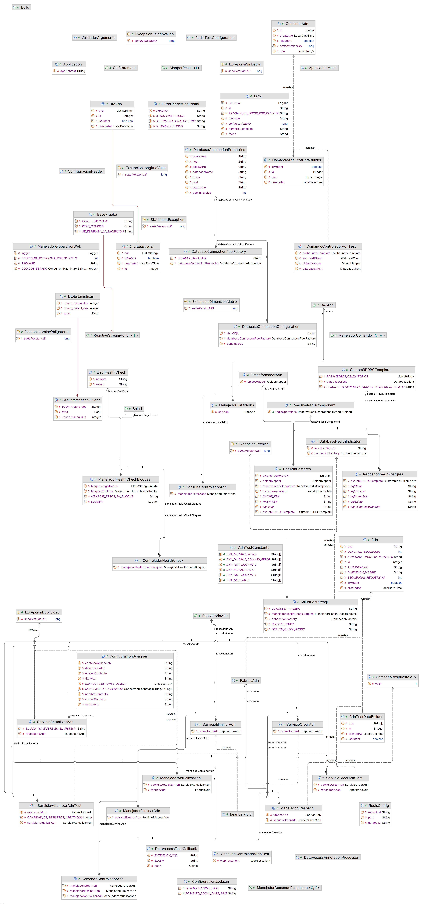
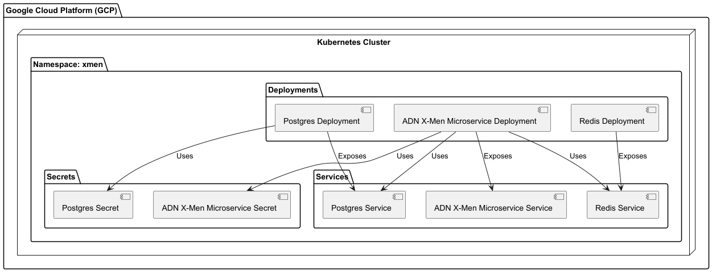
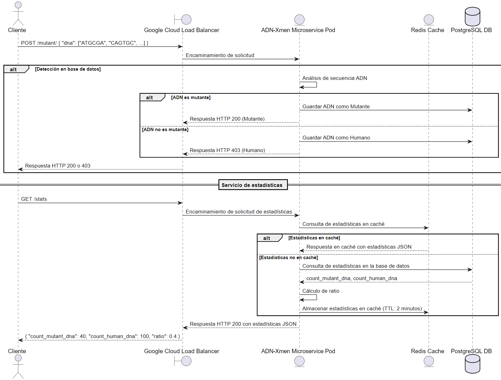
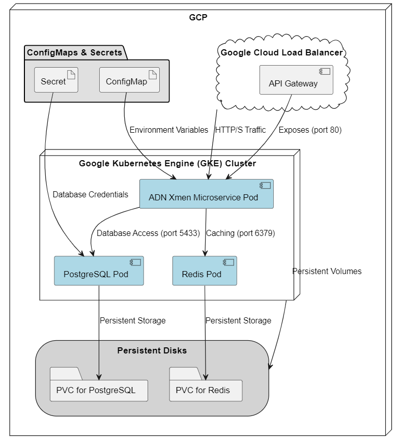
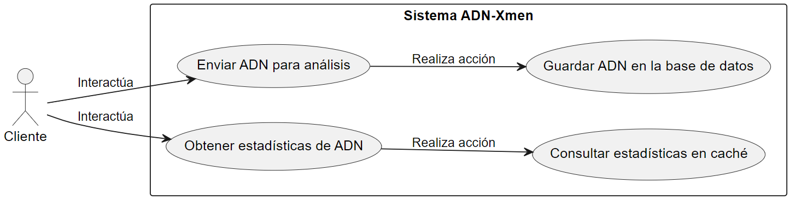
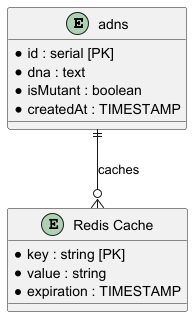
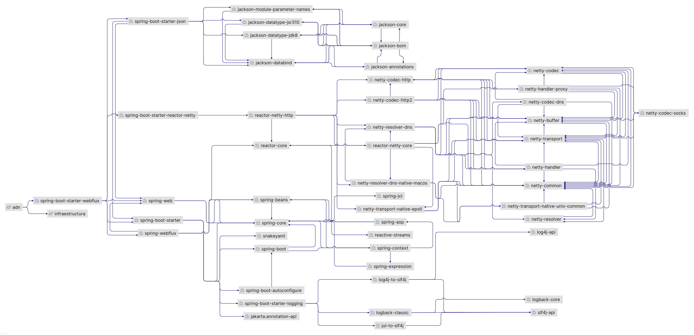
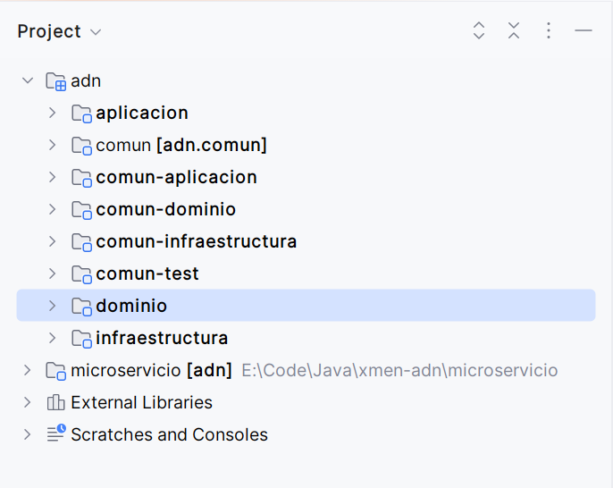
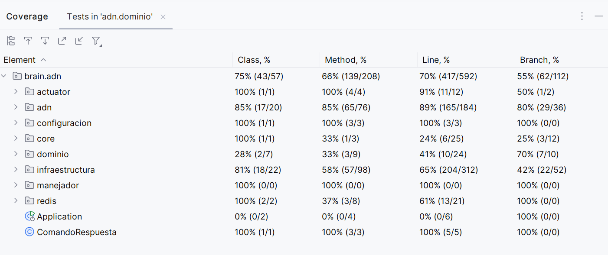

# Xmen

## Tabla de Contenidos

1. [Vista Lógica](#vista-lógica)
   - [Diagrama de Clases](#diagrama-de-clases)
2. [Vista de Desarrollo](#vista-de-desarrollo)
   - [Diagrama de Componentes](#diagrama-de-componentes)
3. [Vista de Procesos](#vista-de-procesos)
   - [Diagrama de Secuencia](#diagrama-de-secuencia)
4. [Vista Física](#vista-física)
   - [Diagrama de Despliegue](#diagrama-de-despliegue)
5. [Vista de Casos de Uso](#vista-de-casos-de-uso)
   - [Diagrama de Casos de Uso](#diagrama-de-casos-de-uso)
6. [Componentes de la Arquitectura en la Nube](#componentes-de-la-arquitectura-en-la-nube)
   - [Google Kubernetes Engine (GKE)](#google-kubernetes-engine-gke)
   - [Google Cloud Load Balancer](#google-cloud-load-balancer)
   - [Configuración y Almacenamiento Seguro](#configuración-y-almacenamiento-seguro)
7. [Diagramas](#diagramas)
   - [Diagrama Entidad-Relación](#diagrama-entidad-relación)
   - [Diagrama de Dependencias](#diagrama-de-dependencias)
8. [Escalabilidad a Nivel de Base de Datos](#escalabilidad-a-nivel-de-base-de-datos)
   - [PostgreSQL](#postgresql)
   - [Redis](#redis)
9. [Scripts de Base de Datos](#scripts-de-base-de-datos)
   - [Creación de Tablas](#creación-de-tablas)
10. [Arquitectura Hexagonal](#arquitectura-hexagonal)
11. [Patrón CQRS](#patrón-cqrs)
12. [Especificaciones Técnicas](#especificaciones-técnicas)
13. [Estructura del Proyecto](#estructura-del-proyecto)
14. [Importación del Proyecto](#importación-del-proyecto)
15. [HealthCheck](#healthcheck)
16. [Resumen Cobertura de Pruebas](#resumen-cobertura-de-pruebas)
17. [Acceder a la Documentación de la API](#acceder-a-la-documentación-de-la-api)

# Arquitectura del Proyecto

Para garantizar la escalabilidad y disponibilidad de la aplicación, se han implementado varios componentes en Google Cloud Platform (GCP). Estos componentes trabajan juntos para asegurar que la aplicación pueda escalar de manera eficiente y manejar aumentos en la carga de trabajo sin comprometer el rendimiento.

## Vista Lógica

### Diagrama de Clases

El diagrama de clases muestra la estructura de las clases en el sistema y sus relaciones en el contexto del microservicio y sus características.



## Vista de Desarrollo

### Diagrama de Componentes

El diagrama de componentes ilustra cómo los diferentes componentes del sistema están organizados y cómo interactúan entre sí.



## Vista de Procesos

### Diagrama de Secuencia

El diagrama de secuencia muestra la interacción entre los diferentes componentes del sistema durante la ejecución.



## Vista Física

### Diagrama de Despliegue

El diagrama de despliegue muestra cómo los componentes del sistema se distribuyen en la infraestructura física.



## Vista de Casos de Uso

### Diagrama de Casos de Uso

El diagrama de casos de uso describe las interacciones entre los actores externos y el sistema.



# Componentes de la Arquitectura en la Nube

## Google Kubernetes Engine (GKE)

GKE es un servicio de orquestación de contenedores administrado, ideal para aplicaciones basadas en microservicios. En este proyecto, GKE aloja los servicios principales, incluidos el microservicio ADN-Xmen y las bases de datos.

## Google Cloud Load Balancer

El balanceador de carga distribuye el tráfico de usuario de manera uniforme entre las instancias en GCP.
Al dirigir el tráfico de manera equilibrada, el balanceador de carga asegura que ninguna instancia esté sobrecargada, mejorando el rendimiento y la disponibilidad de la aplicación.

## Configuración y Almacenamiento Seguro

### ConfigMaps y Secrets

ConfigMaps y Secrets son recursos utilizados para almacenar configuraciones y credenciales de la aplicación de manera segura.
Al almacenar las configuraciones de forma centralizada, es fácil escalar la aplicación sin necesidad de modificar cada instancia individualmente. Esto permite gestionar de manera eficiente variables de entorno, credenciales y configuraciones específicas para cada servicio.

### Diagrama Entidad-Relación

El diagrama entidad-relación muestra la estructura de la base de datos y las relaciones entre las entidades.



### Diagrama de Dependencias

El diagrama de dependencias muestra las dependencias entre los diferentes módulos y componentes del sistema.



### Explicación de la Escalabilidad a Nivel de Base de Datos

#### PostgreSQL
- **Escalado Vertical**: Aumentar el tamaño de la instancia (CPU, memoria) para manejar una mayor carga.
- **Escalado Horizontal**: Usar réplicas de lectura para distribuir el tráfico de lectura y reducir la carga en la instancia principal.

#### Redis
- **Caché**: Almacenar los resultados de consultas pesadas en Redis para reducir la carga en la base de datos PostgreSQL.
- **Expiración**: Establecer un tiempo de expiración (por ejemplo, 2 minutos) para los datos en caché para asegurar que se actualicen periódicamente y se mantengan actualizados.
- **Escalado Horizontal**: Añadir más nodos al clúster de Redis para manejar un mayor número de solicitudes de caché.


### Scripts de Base de Datos

#### Creación de Tablas

```sql
DROP TABLE IF EXISTS adns;

CREATE TABLE adns
(
    id        serial PRIMARY KEY,
    dna       text NOT NULL,
    isMutant  boolean      NOT NULL,
    createdAt TIMESTAMP NULL
);
```


### Arquitectura Hexagonal

La Arquitectura Hexagonal, dada a conocer por Alistair Cockburn &#45; y tambi&eacute;n conocida como arquitectura de **puertos y adaptadores** &#45;,
tiene como principal motivaci&oacute;n separar nuestra aplicaci&oacute;n en distintas capas o regiones con su propia responsabilidad. 
De esta manera consigue desacoplar capas de nuestra aplicaci&oacute;n permitiendo que evolucionen de manera aislada. Adem&aacute;s, 
tener el sistema separado por responsabilidades nos facilitar&aacute; la reutilizaci&oacute;n.

La Arquitectura Hexagonal propone que nuestro dominio sea el n&uacute;cleo de las capas y que este no se acople a nada externo. 
En lugar de hacer uso expl&iacute;cito y mediante el principio de inversi&oacute;n de dependencias nos acoplamos a contratos 
(interfaces o puertos) y no a implementaciones concretas.

Se divide principalmente en tres capas:
- **Infraestructura**: Tiene las responsabilidades de realizar los adaptadores a los puertos definidos en el domino, 
  por ejemplo, exponer web services, consumir web services, realizar conexiones a bases de datos, ejecutar sentencias DML,
  en general, todo lo que sea implementaciones de cualquier framework.
- **Aplicaci&oacute;n**: Encargada de enrutar los eventos entrantes de la capa de infraestructura hac&iacute;a la capa del dominio, 
  generalmente se conoce como una _barrera transaccional_ la cual agrupa toda la invocaci&oacute;n de un caso de uso, 
  se pueden encontrar patrones como Fabricas, Manejadores de Comandos, Bus de eventos, etc.
- **Dominio**: Representa toda la l&oacute;gica de negocio de la aplicaci&oacute;n la cual es la raz&oacute;n de existir del negocio. 
  Se busca evitar el anti-patron [Anemic Domain Model](https://martinfowler.com/bliki/AnemicDomainModel.html) 
  y favorecer el principio [Tell Dont Ask](https://martinfowler.com/bliki/TellDontAsk.html). En esta capa se pueden 
  encontrar: _servicios de dominio_, _entidades_, _objetos de valor_, _repositorios (puerto)_, etc. 

Para saber un poco m&aacute;s sobre este tipo de arquitectura se recomienda visitar el [blog](https://codely.tv/blog/screencasts/arquitectura-hexagonal-ddd/) de **Codely**.

### Patr&oacute;n CQRS

Este patr&oacute;n es recomendado cuando se va desarrollar l&oacute;gica de negocio compleja porque nos ayuda a separar las responsabilidades 
y a mantener un modelo de negocio consistente. Con fines pr&aacute;cticos los controladores (servicios REST) se definieron siguiendo 
el esquema propuesto por este patr&oacute;n. 


Para mayor informaci&oacute;n sobre el patr&oacute;n visitat las [web](https://martinfowler.com/bliki/CQRS.html) Martin Fowler.

## Especificaciones t&eacute;cnicas

- Gradle (7.0.2).
- Java (11).
- Spring Framework (5.3.9).
    - Spring Boot (2.5.3).
    - Spring Webflux (2.5.3).
    - Spring Data R2DBC (1.3.3).
    - Reactor core (3.4.9).
      - Reactor test (3.4.9).
 - Se debe tener configurado el IDE con [Lombok](https://projectlombok.org/download).


## Lo qu&eacute; encontrar&aacute;s en el bloque:
 
 - Acceso a base de datos relacional por medio de [R2DBC](https://docs.spring.io/spring-data/r2dbc/docs/1.2.8/reference/html/#reference) (y su cliente _DatabaseClient_).

- Implementaci&oacute;n de Redis para el manejo de cach&eacute;. [Spring Data Redis](https://docs.spring.io/spring-data/redis/docs/2.5.3/reference/html/#reference).
   > La configuraci&oacute;n actual del _connection pool_ permite cualquier gestor de base de datos relacional (SGBD) soportado por la librer&iacute;a de 
   > [Spring Data Reactor](https://spring.io/projects/spring-data-r2dbc). Actualmente se tiene configurada una conexi&oacute;n con
   > [Postgresql](https://github.com/pgjdbc/r2dbc-postgresql). Para cambiar de SGBD solo deber&aacute; incoporar la librer&iacute;a correspondiente
   > y actualizar los parametros de configuraci&oacute;n definidos en el archivo **application.yml** bajo el contexto de **database**. 
   

 - Ejemplo de pruebas unitarias implementando [StepVerifier](https://projectreactor.io/docs/test/release/api/reactor/test/StepVerifier.html#:~:text=A%20StepVerifier%20provides%20a%20declarative,that%20will%20happen%20upon%20subscription.).
 - Ejemplo de pruebas de integraci&oacute;n con H2.
 - Documentaci&oacute;n de los servicios REST siguiendo la especificaci&oacute;n [OpenAPI](https://swagger.io/docs/specification/about/).

## Estructura del proyecto 
Se identifican dos carpetas principales, _com&uacute;n_ y _microservicio_. 

El proyecto _microservicio_ es la carpeta que contiene todo el c&oacute;digo  fuente para el primer microservicio de su proyecto, 
se recomienda cambiar el nombre de esta carpeta siguiendo la l&oacute;gica  de negocio y posteriormente modificar el archivo 
*settings.gradle*, si necesita crear m&aacute;s microservicios lo &uacute;nico que debe  realizar es duplicar esta carpeta y realizar 
la modificaci&oacute;n en el archivo *settings.gradle*. 

El proyecto _com&uacute;n_ contiene c&oacute;digo fuente que comparten todos los microservicios y capas, 
es una librer&iacute;a que importan los que requieran este c&oacute;digo compartido, es importante tener en cuenta que no debe ir c&oacute;digo 
de negocio en este lugar. 

## Importaci&oacute;n el proyecto

git clone https://github.com/julian36alvarez/xmen-cerebro.git
cd xmen-cerebro/microservicio

Para importar el proyecto se recomienda usar Gradle en la versi&oacute;n especificada en la secci&oacute;n anterior, y se debe realizar 
desde la ruta *microservicio/build.gradle*.

Despu&eacute;s de importar el proyecto se ver&aacute; de la siguiente manera:



# HealthCheck
Tiene como fin determinar el estado de otros bloques o servicios agregados como por ejemplo de postgres, mysql, etc. Para esto es necesario crear un paquete _actuator_ en _microservicio-consulta-infraestructura_ e implementar la interfaz llamada _Salud_ con la anotaci&oacute;n _@Component_ sobre-escribiendo los siguientes metodos:

- **registrarBloque()**: Tiene la funcion de registrar el bloque que se quiere monitorear, para esto es necesario que a la hora de construir la clase que implemente la interface _Salud_ se inyecte la clase _manejadorHealthCheckBloques_ que registra en memoria los bloques 
implementados, mediante su nombre y la implementaci&oacute;n de _Salud_ en s&iacute;.

- **verificar()**: Su definici&oacute;n es delegada al criterio del _developer_, &eacute;l/la cual debe definir la l&oacute;gica que permita determinar si el bloque/servicio est&aacute; disponible o no. Como restricci&oacute;n se deben tener presente los siguientes dos escenarios: 
  (1) En caso de presentarse alguna anomal&iacute;a se debe retonar un Mono.error() con una ExcepcionTecnica y (2) en caso contrario, un Mono.empty().

Al momento de crear el bloque principal pedira un tiempo que estara dado en  milisegundos llamado _tiempoHealthCheck_ que estar&aacute; guardado en el archivo _application.yaml_ del microservicio.

**Nota:** Debe tener presente el tiempo asignado al HealthCheck, como tal en las base de datos el tiempo que se tarda en verificar es de 30000 milisegundos, entonces debe ser mayor a este, para que cuando healthCheck realice la revisi&oacute;n, ya todos los bloques se hayan reportado, evitando tener  inconsistencias en
los valores devueltos. Se esperar&iacute;a aumentar el tiempo cada vez que un bloque se implemente, por supuesto dependiendo tambien de su tiempo de retardo.

# Resumen cobertura de pruebas



## Acceder a la documentación de la API:

Abre tu navegador y navega a [http://34.28.238.78/v3/api-docs](http://34.28.238.78/v3/api-docs) para ver la documentación de los servicios en OpenApi.

### Endpoints disponibles:

- **POST /mutant**: Crear Adn
- **GET /stats**: Listar Adns
- **GET /healthCheck**: Health Check

### Ejemplo de solicitud:

- **Crear Adn**:
  ```sh
  curl -X POST "http://34.28.238.78/mutant" -H "accept: application/json" -H "Content-Type: application/json" -d "{ \"dna\": [\"ATGCGA\",\"CAGTGC\",\"TTATGT\",\"AGAAGG\",\"CCCCTA\",\"TCACTG\"] }"

